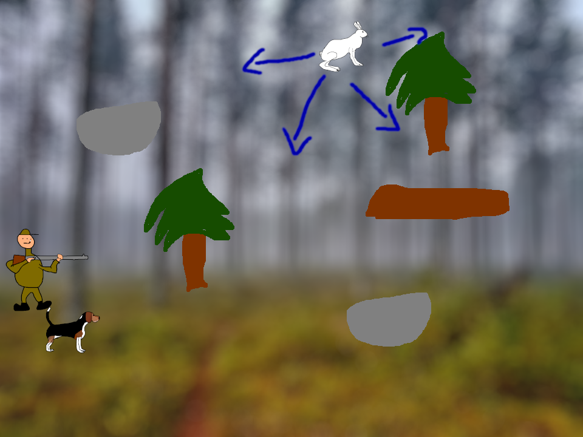
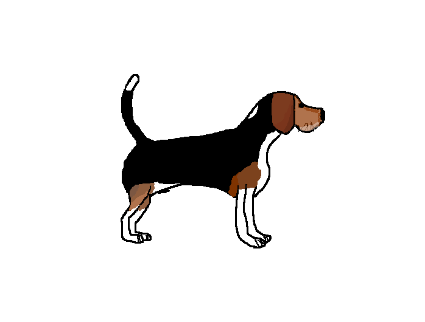
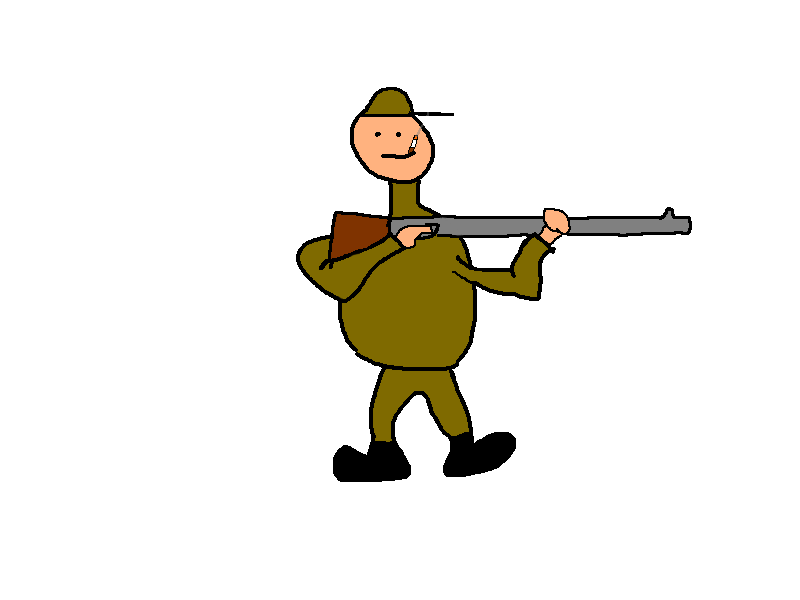
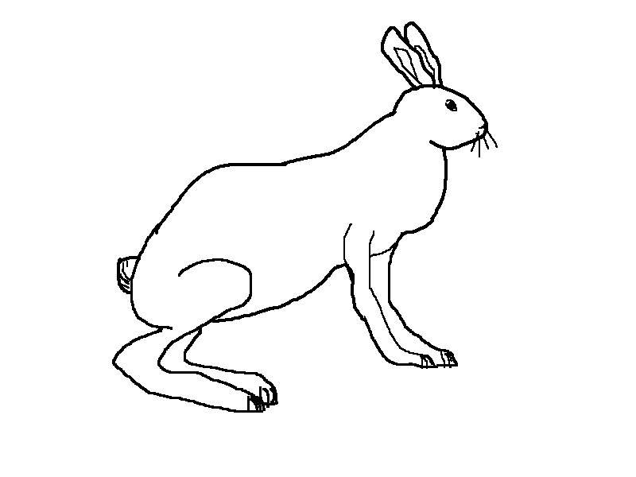
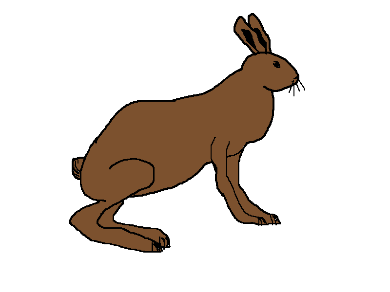

# Harjoitustyön suunnitelma

## Tietoja 

Tekijä: Aaro Koinsaari

Työ git-varaston osoite: <https://gitlab.jyu.fi/aarkasko/ohj1ht>

Pelin nimi: Jäniksen metästys

Pelialusta: Windows

Pelaajien lukumäärä: 1

## Pelin tarina

Metsästyskausi on taas alkanut, ja Hugo-koira on lähtenyt jänismetsälle tavoitteenaan saada mahdollisimman monta jänistä kiinni. Hugon tehtävänä on löytää jänis metsästä, saada se liikkeelle ja ajaa se suoraan metsästäjän luokse, joka pysäyttää tämän. Onnistuuko Hugo löytämään jäniksiä ja tuomaan ruokapöytään jouluksi herkullista jänispaistia?

## Pelin idea ja tavoitteet

Kyseessä on tasohyppelypeli. Hugo-koiran on ensin löydettävä piilossa oleva jänis kentältä, joka kuitenkin löydyttyään juoksee aina karkuun Hugoa. Jänis on yleensä liian nopea, joten tavoitteena on ajaa jänis tietyssä paikassa odottavan metsästäjän luokse, joka lopulta viimeistelee homman.

Hugo-koiralla on kaksi minuuttia aikaa löytää ja metsästää niin monta jänistä kuin mahdollista.

## Hahmotelma pelistä

## Toteutuksen suunnitelma

Helmikuu

- Laitan Hugon liikkeelle
- Teen ensimmäiset pelikentät
- Teen esteet kentälle ja niistä silmukan

Maaliskuu

- Laitan taulukkoon jäniksen/rusakon ja pelikentät (jahdattavaksi tulee jänis tai rusakko sen mukaan, millainen maasto on kyseessä)
- Laitan jäniksen/rusakon liikkumaan Hugoa karkuun sen ollessa tietyllä etäisyydellä.
- Teen metsästäjän
- Lisään pistetaulukon ja ajastimen
- Lisään äänet

Jos aikaa jää

- Laitan Hugon haukkumaan napin painalluksesta
- Lisään kentälle jäniksen jälkiä
- Parannan animaatioita ja kenttiä
- Lisään taulukkoon erilaisia esteitä vaihtumaan maaston mukaan